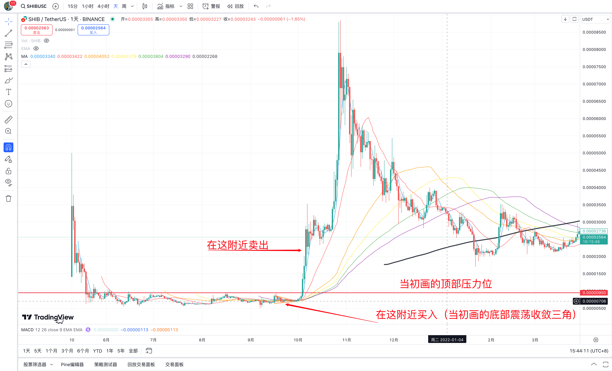

# 交易回顾

我是在21年5月份shib刚上线的时候第一次知道这个币，当初刚上线的那一个周，就一路从1500左右一路涨到5000，然后开始关注并了解这个币。这个币和当时最热门的doge一样，都是以一只柴犬为形象的meme币，上线的时候就自称为狗狗币杀手，也和doge一样拥有广大的社群基础，最开始好像是1000亿的发行总量，持币地址数量也非常巨大。

刚上线一周后，就开始一路下跌，最低跌到500左右，然后进入了持续近半年的底部区间震荡（500-900）。经过最后一次冲击900回落过后，日线的均线进入了收敛状态，同时也在一个4h的大三角形内震荡（如我下图当时画的一个三角形）。

当时看到了这些信息后，把这个币告诉了朋友（简称Y），和他分析讨论后一致认为这个币已经走到了形态的末端，即将开始新的趋势行情，所以在三角震荡的过程中，持续买入了一些币，甚至卖掉了手里的一些ETH买入shib（当时ETH好像在2700左右），最终以700+左右的均价买了7000+u，折合人民币差不多5w，持币10亿左右。

不出所料，在持续了半个月的三角震荡过后，均线开始发散，进入多头排列的形态（当时在油管看雷公的视频学习的这套均线理论）。并且在短短几天突破了压力位900，突破后，在接下来的一个月时间里，开始了一发不可收拾的狂暴大行情。

图里可以看出，我在突破900后的第三天，当价格达到2000左右时，就已经全部卖出了手里所有的仓位。卖出后的第二天甚至涨到3500的位置，然后又进入了一个上升趋势的中继震荡中，这个阶段又持续了2周左右。这个过程中最低回调到2500左右，但依然高于我卖出的价格，所以没敢重新上车，而且当时的认知也比较狭隘，觉得已经从700涨到35000有了4倍涨幅，再重新上车很容易被套，所以就一直观望了，没想到卖出后不到2周，才是真正打破认知的开始，涨到怀疑人生的9000，从我买入的700算接近13倍。

# 均线示意图

# 血泪总结

1. 提高认知。

    其实从当初画的图来看，虽然刚接触币圈不久，也才刚学会均线这些技术指标，但是对它的分析还是非常准确的（在此币不温不火的情况下，精准选中这个在未来一个月市场最火热最牛逼的币，市值直接涨到前十），当初分析时基于的一些条件，现在回头来看依然非常有效，比如：
        
    1. 低位区间缩量震荡s
    2. 震荡过程中没有出现更低的点，每次到低点都能反弹回来
    3. 震荡末期出现了4h级别的三角震荡
    4. 当时我记得还有个消息面，就是shib官方把发行量的一半，也就是500亿打到的v神的地址里，但是v神又把这些币打到了黑洞钱包，等于这个币的最大发行量直接减半，同样市值的情况下，理论上价格应该要翻倍
    
    但是当初还是个新手，认知和格局不够，是赚不到认知以外的钱的，以及操作变形，所以也没什么好遗憾的，只是现在每次回想起来，觉得有点可惜（五六十万rmb呀）。

2. 跟随趋势，顺大逆小。

    不要在趋势运行过程中操作，而是应该在趋势结束时操作。

    当时在2000左右全部卖掉的主要原因是：涨的太快，浮盈太多，害怕一觉醒来又跌回去了。
    
    其实以现在的认知来看，趋势结束后，大概率会进入调整阶段，以震荡下跌为主，有大量的时间和点位可以卖出，并且震荡过程中的位置，大概率比运行过程中的位置要高。所以2000的时候还在上升趋势中，不应该卖出，即便卖出，也不应该全部卖出。另外即便2000可能是顶部，接下来震荡过程中，也一定是在2000上下，所以当时后再卖也不晚。

3. 应以客观信号作为交易标准，而不以主观臆测作为交易标准。

    当时其实900突破时可以加仓，突破900也是一个非常关键的信号。信号其实代表的是从一个阶段进入另一个阶段，是确定的，更好量化的，也更容易执行的。

    以信号为交易标准，也能更好的判断趋势进入了什么阶段，比如走出三角形态的信号，可能代表结束当前震荡行情，进入趋势行情；比如突破区间震荡的压力位的信号，可能代表结束震荡行情，进入趋势行情；比如跌破20日EMA趋势线的信号，可能代表趋势即将反转，要注意风险。。。当然这些例子都只是代表一种更大的可能行，但以足够作为交易的依据支撑。

这是我交易记录系列的第一篇，因为是第一次准确抓住了机会，但是又让机会飞走的一次，直接一座金矿从手里丢掉了。700到9000，13倍，我只盈利2倍就全卖了，一波错过几十万，它值得作为我的第一篇总结。